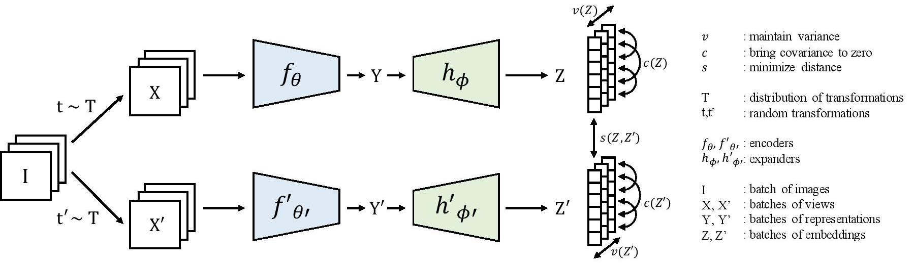

# VICReg: Variance-Invariance-Covariance Regularization For Self-Supervised Learning

This repository provides a PyTorch implementation and pretrained models for VICReg, as described in the paper [VICReg: Variance-Invariance-Covariance Regularization For Self-Supervised Learning](https://arxiv.org/abs/2105.04906)\
Adrien Bardes, Jean Ponce and Yann LeCun\
Meta AI, Inria

--- 

<!-- 
<div align="center">
  
</div> -->

<p align="center">

</p>

## Pre-trained Models

You can choose to download only the weights of the pretrained backbone used for downstream tasks, or the full checkpoint which contains backbone and projection head weights.

<table>
  <tr>
    <th>arch</th>
    <th>params</th>
    <th>accuracy</th>
    <th colspan="6">download</th>
  </tr>
  <tr>
    <td>ResNet-50</td>
    <td>23M</td>
    <td>73.2%</td>
    <td><a href="https://dl.fbaipublicfiles.com/vicreg/resnet50.pth">backbone only</a></td>
    <td><a href="https://dl.fbaipublicfiles.com/vicreg/resnet50_fullckpt.pth">full ckpt</a></td>
  </tr>
  <tr>
    <td>ResNet-50 (x2)</td>
    <td>93M</td>
    <td>75.5%</td>
    <td><a href="https://dl.fbaipublicfiles.com/vicreg/resnet50x2.pth">backbone only</a></td>
    <td><a href="https://dl.fbaipublicfiles.com/vicreg/resnet50x2_fullckpt.pth">full ckpt</a></td>
  </tr>
  <tr>
    <td>ResNet-200 (x2)</td>
    <td>250M</td>
    <td>77.3%</td>
    <td><a href="https://dl.fbaipublicfiles.com/vicreg/resnet200x2.pth">backbone only</a></td>
    <td><a href="https://dl.fbaipublicfiles.com/vicreg/resnet200x2_fullckpt.pth">full ckpt</a></td>
  </tr>
</table>

## Pretrained models on PyTorch Hub

```python
import torch
resnet50 = torch.hub.load('facebookresearch/vicreg:main', 'resnet50')
resnet50x2 = torch.hub.load('facebookresearch/vicreg:main', 'resnet50x2')
resnet200x2 = torch.hub.load('facebookresearch/vicreg:main', 'resnet200x2')
```


## Training

Install PyTorch ([pytorch.org](http://pytorch.org)) and download [ImageNet](https://imagenet.stanford.edu/). The code has been developed for PyTorch version 1.7.1 and torchvision version 0.8.2, but should work with other versions just as well.

### Single-node local training

To pretrain VICReg with ResNet-50 on a single node with 8 GPUs for 100 epochs, run:

```
python -m torch.distributed.launch --nproc_per_node=8 main_vicreg.py --data-dir /path/to/imagenet/ --exp-dir /path/to/experiment/ --arch resnet50 --epochs 100 --batch-size 512 --base-lr 0.3
```

### Multi-node training with SLURM

To pretrain VICReg with [submitit](https://github.com/facebookincubator/submitit) (`pip install submitit`) and SLURM on 4 nodes with 8 GPUs each for 1000 epochs, run:

```
python run_with_submitit.py --nodes 4 --ngpus 8 --data-dir /path/to/imagenet --exp-dir /path/to/experiment/ --arch resnet50 --epochs 1000 --batch-size 2048 --base-lr 0.2
```


## Evaluation

### Linear evaluation

To evaluate a pretrained ResNet-50 backbone on linear classification on ImageNet, run:

```
python evaluate.py --data-dir /path/to/imagenet/ --pretrained /path/to/checkpoint/resnet50.pth --exp-dir /path/to/experiment/ --lr-head 0.02
```

### Semi-supervised evaluation

To evaluate a pretrained ResNet50-model on semi-supervised fine-tunning on 1% of ImageNet labels, run:

```
python evaluate.py --data-dir /path/to/imagenet/ --pretrained /path/to/checkpoint/resnet50.pth --exp-dir /path/to/experiment/ --weights finetune --train-perc 1 --epochs 20 --lr-backbone 0.03 --lr-classifier 0.08 --weight-decay 0
```

To evaluate a pretrained ResNet50-model on semi-supervised fine-tunning on 10% of ImageNet labels, run:

```
python evaluate.py --data-dir /path/to/imagenet/ --pretrained /path/to/checkpoint/resnet50.pth --exp-dir /path/to/checkpoint/resnet.pth --weights finetune --train-perc 10 --epochs 20 --lr-backbone 0.01 --lr-classifier 0.1 --weight-decay 0
```

## Acknowledgement

This repository is built using the [Barlow Twins](https://github.com/facebookresearch/barlowtwins) repository.

## License

This project is released under CC-BY-NC License, which limits use to non-commercial use. See [LICENSE](LICENSE) for details.

## Citation
If you find this repository useful, please consider giving a star :star: and citation:

```
@inproceedings{bardes2022vicreg,
  author  = {Adrien Bardes and Jean Ponce and Yann LeCun},
  title   = {VICReg: Variance-Invariance-Covariance Regularization For Self-Supervised Learning},
  booktitle = {ICLR},
  year    = {2022},
}
```
